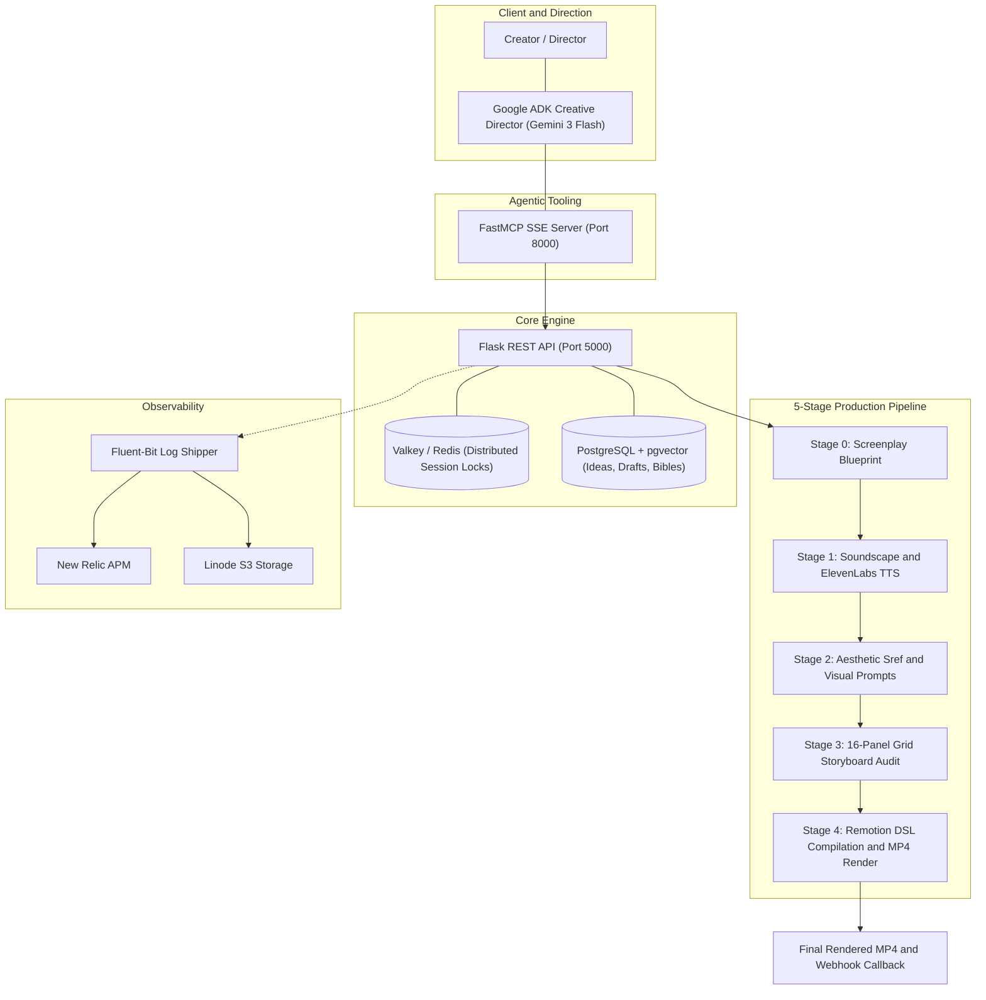

# Baasha: Multi-Modal Text-to-Video Production Engine

[](https://www.python.org/)
[](https://flask.palletsprojects.com/)
[](https://ai.google.dev/)
[](https://modelcontextprotocol.io/)
[-0B84F3?style=flat-square&logo=react&logoColor=white)](https://www.remotion.dev/)
[](https://www.postgresql.org/)
[](https://valkey.io/)
[](https://www.docker.com/)

An end-to-end production engine and AI Creative Director for serialized short-form video. The system couples multi-modal generation (Gemini, ElevenLabs, image diffusion) with a declarative JSON video DSL rendered via a headless Remotion engine, maintaining character continuity across episodes and enabling non-destructive, agentic editing.

---

## Video Demos

### 1. Studio Walkthrough & Architecture Demo
A complete 15-minute walkthrough of the production board, screenplay blueprinting, character reference locking, and stage transitions:

[](https://youtu.be/7JbBc1PEM34)

> **Link**: [Watch Full Studio Walkthrough on YouTube (15 mins)](https://youtu.be/7JbBc1PEM34)

---

### 2. Generated Output Sample
Cinematic short generated entirely through the pipeline (Interstellar docking scene recreation):

[](https://www.youtube.com/shorts/SSpNvivciqU)

> **Link**: [Watch Generated Output on YouTube Shorts](https://www.youtube.com/shorts/SSpNvivciqU)

---

## Core Problem & Technical Approach

| Challenge | Technical Solution |
| :--- | :--- |
| **Character Drift Across Shots** | **Continuity Protocol**: Extracts reference portrait anchors and queries `pgvector` memory across episodes to lock facial geometry and aesthetic. |
| **Un-editable Black-Box Video** | **Declarative Video DSL**: Serializes video into a JSON AST rendered by Remotion. The AI agent edits the AST directly without re-rendering unaffected assets. |
| **Directorial & Pacing Control** | **16-Panel Locked Grid**: Maps scene shot lists to rigid canvas templates (`grid.png`) to lock horizon lines and staging prior to video assembly. |
| **Pipeline Race Conditions** | **Valkey Session Locks**: Deterministic 5-minute distributed locks per draft stage to prevent parallel GPU/render overwrite conflicts. |

---

## System Architecture



---

## Key Engineering Highlights

### 1. Declarative Video DSL and Remotion React Renderer
Instead of generating monolithic, un-editable video files, the pipeline compiles video compositions into a JSON Abstract Syntax Tree (AST):
* **Component Primitives**: Supports `parallel` (Z-Stack / V-Stack), `transition` (emerge, slide), `img` (with wobble and zoom keyframes), `audio`, and `subtitle_text`.
* **Phoneme Alignment**: Subtitles map to sub-second audio `timepoints` emitted by the TTS engine.
* **Non-Destructive AI Editing**: The LLM agent inspects and modifies the JSON AST directly (e.g. adjusting font weights, transition durations, or audio ducking) without triggering expensive image/audio re-generation.
* **Headless Chromium Execution**: A custom `parseConfig` compiler dynamically resolves JSON nodes to React component closures rendered via Remotion (`@remotion/renderer`) on Docker/Lambda.

### 2. Agentic Creative Director (Google ADK + FastMCP)
Implemented in `agents/baasha_director/agent.py` and `mcp_server.py`:
* Built on Google ADK with `gemini-3-flash-preview` communicating via Server-Sent Events (SSE) over FastMCP.
* Exposes 15+ specialized video tools for screenplay blueprinting, moodboard generation, stage advancement, and asset auditing.
* Implements mandatory human-in-the-loop checkpoints before advancing pipeline stages.

### 3. Episodic Continuity & Lineage Protocol
* **Character Bibles**: Extracts facial structural anchors (eye shape, nose profile, jawline silhouette) to constrain diffusion prompts.
* **Vector Memory**: Uses `pgvector` embeddings to identify recurring characters and visual styles across multi-episode series.

### 4. Distributed State Machine & Locking
* Multi-minute asset generation is synchronized via Valkey (Redis-compatible key-value store).
* Optimistic distributed locks with automatic 5-minute timeouts prevent parallel write collisions while drafts progress through stages 0 to 4.

### 5. Production Observability & Infrastructure
* **Gateway**: Caddy reverse proxy providing automatic TLS termination and dynamic domain routing.
* **Telemetry**: Fluent-Bit daemon streaming structured application logs and stack traces to New Relic APM and Linode Object Storage (S3-compatible).
* **Async Callbacks**: Long-running video renders trigger authenticated webhook notifications upon completion.

---

## Technology Stack

* **Backend**: Python 3.11, Flask, Flask-RESTful, SQLAlchemy, Pydantic
* **AI & Agentic Systems**: Google Agent Development Kit (ADK), Gemini 3 Flash, FastMCP
* **Video Rendering**: Remotion 4.x, React, Node.js, FFmpeg, ImageMagick
* **Data & Cache**: PostgreSQL, `pgvector`, Valkey / Redis
* **Audio & Multi-Modal**: ElevenLabs, Fal.ai Diffusion APIs, NLTK, TextBlob
* **DevOps & Observability**: Docker Compose, Caddy, Fluent-Bit, New Relic, Linode S3

---

## Documentation & Quick Start

* [Deployment & Local Setup Guide (DEPLOYMENT.md)](DEPLOYMENT.md)
* [REST API Documentation (API_DOC.md)](API_DOC.md)
* [Valkey Setup & Docker Configuration (VALKEY.md)](VALKEY.md)

### Running Services
```bash
# Start backend and gateway (Docker)
docker compose --profile prod up -d

# Start FastMCP server (Port 8000)
python mcp_server.py

# Start Creative Director Agent
python -m agents.baasha_director.agent
```
