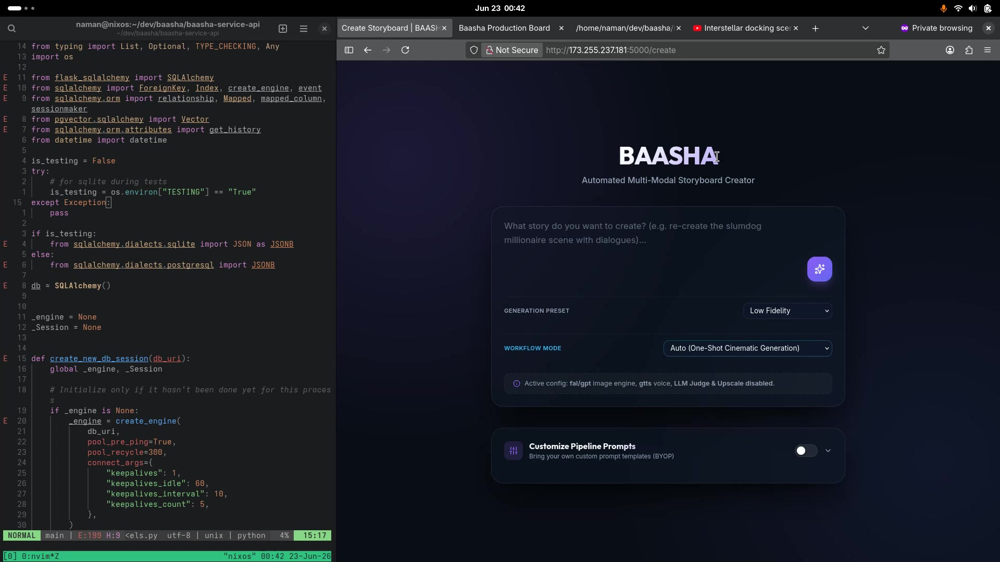
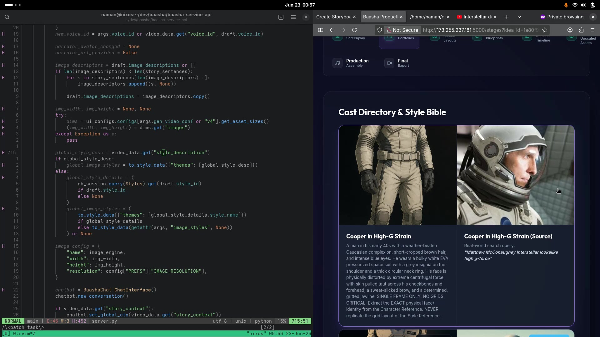
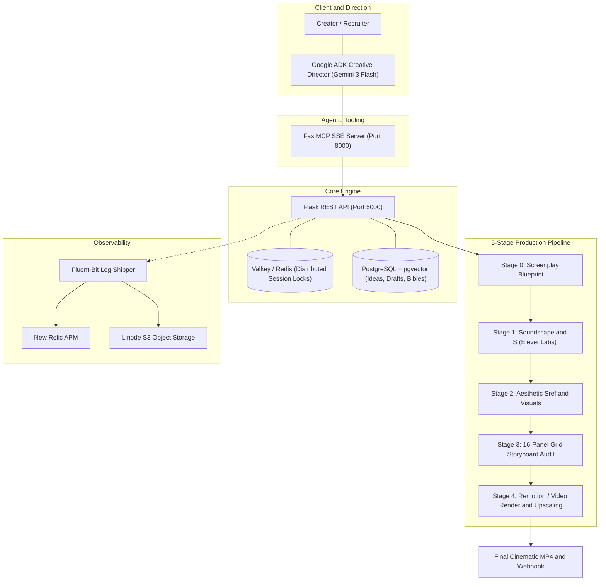

# 🎬 Baasha — Text-to-Video Workflow & Creative Production Engine

[](https://www.python.org/)
[](https://flask.palletsprojects.com/)
[](https://ai.google.dev/)
[](https://modelcontextprotocol.io/)
[](https://www.postgresql.org/)
[](https://valkey.io/)
[](https://www.docker.com/)
[](https://newrelic.com/)

> **An end-to-end multi-modal AI video production engine and Agentic Creative Director.**  
> Transforms narrative ideas into cinematic short-form videos with **consistent character identity**, **locked-grid storyboard synthesis**, **voiceover soundscapes**, and **collaborative LLM screenplay negotiation**.

---

## 📺 Demos & Showcase

### 1. 🌟 Final Rendered Output Demo (Interstellar Docking Scene Remake)
See the final cinematic output generated completely through this workflow:

[](https://www.youtube.com/shorts/SSpNvivciqU)

> 🔗 **[▶️ Watch the Generated Video on YouTube Shorts](https://www.youtube.com/shorts/SSpNvivciqU)**  
> *Showcases multi-shot cinematic pacing, character likeness preservation under high-G strain, synchronized voiceover narration, and dynamic background scoring.*

---

### 2. 🎥 System & Studio Walkthrough (Production Board in Action)
A 15-minute recorded deep-dive into the entire production workflow, from initial idea and screenplay blueprint negotiation to cast directory locking, audio selection, storyboard generation, and final rendering:

| Studio Creation Interface | Cast Directory & Style Bible |
| :---: | :---: |
|  |  |
| *Interactive Studio UI with Workflow Presets & BYOP Prompts* | *Character Reference Ingestion & Facial Identity Locking* |

> 📁 **Local Video Walkthrough**: **[🎬 Watch Full Video Walkthrough (docs/walkthrough_demo.mp4)](docs/walkthrough_demo.mp4)**  
> *(1080p walkthrough showcasing the live Flask API, Neovim development environment, Valkey stage transitions, and interactive UI).*

---

## 💡 The Problem & The Baasha Solution

| The Industry Bottleneck | How Baasha Solves It |
| :--- | :--- |
| **Character Drift & Inconsistency**: Traditional diffusion models produce drastically different faces across shots. | **Continuity & Lineage Protocol**: Ingests Character Bibles, face embeddings via `pgvector`, and facial structural anchors before rendering. |
| **Lack of Directorial Control**: Black-box text-to-video tools output uneditable, arbitrary video clips. | **Locked Base-Grid Storyboards**: Generates multi-panel storyboards mapped to rigid camera grids (e.g. 16-panel layouts) before video compilation. |
| **Race Conditions in Async Pipelines**: Multi-minute generation tasks frequently collide or overwrite state. | **Valkey Distributed Locks**: Optimistic 5-minute distributed session locks per draft stage with deterministic state transitions. |
| **Disjointed Multi-Modal Assets**: Voice, music, prompts, and video clips live in isolated tools. | **Unified 5-Stage Orchestration**: Single state machine linking screenplay negotiation, TTS synthesis, visual prompt engineering, and audio-video muxing. |

---

## 🏛️ System Architecture



---

## ⚡ Core Engineering Highlights

### 1. 🤖 Agentic Creative Partner (Google ADK + FastMCP)
* Located in `agents/baasha_director/agent.py` and `mcp_server.py`.
* Powered by **Google ADK** (Agent Development Kit) using `gemini-3-flash-preview` connected to a custom **FastMCP** server over Server-Sent Events (SSE).
* Operates not as a blind one-shot generator, but as a collaborative **Creative Director**:
  1. **Discovers Precursors**: Searches `pgvector` database for matching series concepts.
  2. **Negotiates Screenplay**: Co-authors markdown blueprints and explicitly asks for creator approval before invoking GPU resources.
  3. **Visual Auditing**: Promotes generated panel images directly into ADK UI artifacts and prompts the user for surgical corrections.

### 2. 🧬 The Continuity & Lineage Protocol
* **Character Consistency**: Uses reference portrait extraction and strict structural constraints (exact eye shape, eyelid spacing, facial bone structure, lighting angles) to preserve identity across 100% of scenes.
* **Aesthetic Continuity**: Ingests custom style references (e.g. 1980s–1990s Japanese cel animation aesthetic, muted cinematic tones, chiaroscuro lighting).
* **Episodic Memory**: Remembers past characters, voice profiles, and music scores across episodes via vector similarity.

### 3. 🔒 Distributed State Machine with Valkey Locks
* Rendering high-resolution multi-modal media takes minutes. To prevent parallel request race conditions, the engine uses **Valkey (open-source Redis)**.
* Employs deterministic optimistic session locking (`valkey_client`) with automatic 5-minute expiries during stages:
  * **Stage 0**: Narrative & Scene Context
  * **Stage 1**: Voiceover & Audio Assembly
  * **Stage 2**: Visual Prompt Generation & Moodboard
  * **Stage 3**: Storyboard Generation & Human-in-the-Loop Audit
  * **Stage 4**: Video Rendering, Subtitle Synchronization, and Final Export

### 4. 🎛️ Storyboard Grid Generation
* Uses locked multi-panel layout templates (`grid.png`, 16-panel aspect ratio canvas).
* Instead of generating independent, disconnected scenes, the pipeline binds the scene shot list into a cohesive grid canvas, enforcing unified perspective, horizon lines, and lighting continuity across the sequence.

### 5. 📊 Production-Grade Observability & Infrastructure
* **Caddy Gateway**: Reverse proxy handling automatic Let's Encrypt TLS certificates and dynamic subdomain routing (`${REGION}-${ID}.api.pataka.app`).
* **Fluent-Bit Pipeline**: High-throughput log collection shipping structured application events to **New Relic APM** and persistent storage to **Linode S3 Object Storage**.
* **Asynchronous Webhooks**: Long-running video renders trigger authenticated webhook callbacks to client applications upon completion.

---

## 🛠️ Technology Stack

| Category | Technologies |
| :--- | :--- |
| **Backend & Core** | Python 3.11, Flask, Flask-RESTful, SQLAlchemy, Pydantic |
| **Agentic AI & LLMs** | Google Agent Development Kit (ADK), Gemini 3 Flash, FastMCP |
| **Database & Caching**| PostgreSQL, `pgvector` (Vector Embeddings), Valkey (Redis Protocol) |
| **Multi-Modal Generation** | ElevenLabs (TTS), Fal.ai / Diffusion APIs, NLTK, TextBlob, Pillow |
| **Video & Media Processing** | FFmpeg, ImageMagick, Remotion Pipeline |
| **DevOps & Infrastructure** | Docker, Docker Compose, Caddy (Reverse Proxy & SSL), Linux / NixOS |
| **Observability** | Fluent-Bit, New Relic APM, Linode Object Storage (S3-compatible) |

---

## 🗂️ Repository Structure

```
.
├── agents/
│   └── baasha_director/      # Google ADK Creative Director agent
├── docs/
│   ├── walkthrough_demo.mp4  # 15-minute studio walkthrough video
│   ├── walkthrough_preview.jpg
│   └── style_bible_preview.jpg
├── scripts/                  # DB provisioning, network setup, and dev scripts
├── server.py                 # Core Flask REST API & pipeline routing
├── processor.py              # Multi-modal media rendering & storyboard engine
├── mcp_server.py             # FastMCP SSE server exposing 15+ production tools
├── models.py                 # SQLAlchemy schemas & pgvector embeddings
├── parsers.py                # Request validation & API payload schemas
├── Dockerfile                # Production container specification
├── API_DOC.md                # Comprehensive REST API reference
├── DEPLOYMENT.md             # Complete Docker & local deployment instructions
└── README.md                 # Project showcase & architectural documentation
```

---

## 🚀 Getting Started & Documentation

For complete deployment steps, Docker Compose instructions, and environment configuration:

👉 **[Read the Full Deployment & Setup Guide (DEPLOYMENT.md)](DEPLOYMENT.md)**  
👉 **[Explore the API Documentation (API_DOC.md)](API_DOC.md)**  
👉 **[Read the Valkey Configuration Guide (VALKEY.md)](VALKEY.md)**  

### Quick Run (Production via Docker)
```bash
docker compose --profile prod up -d
```

### Quick Run (Creative Director Agent)
```bash
# Terminal 1: Launch MCP Server
python mcp_server.py

# Terminal 2: Launch Creative Director Agent
python -m agents.baasha_director.agent
```

---

## 👨‍💻 Author & Contact

Built with passion for next-generation cinematic AI tooling.  
Feel free to reach out for inquiries, collaboration, or engineering roles!
